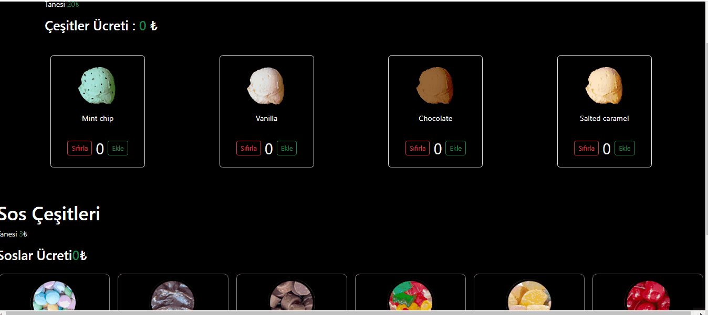

# Selectors

https://testing-library.com/docs/ecosystem-testing-library-selector/

# Matchers

https://github.com/testing-library/jest-dom

# Html Element Rolleri

https://developer.mozilla.org/en-US/docs/Web/Accessibility/ARIA/Roles

# Kütüphaneler

- axios@^0.27.2
- @testing-library/user-event@14.0
- json-server
- bootstrap

# Test Geliştirme

## TDD (Test Drive Development)

- diğer adı red to green test

- önce özelliğin - bileşenin testi yazılır ardından özellik kodlanır

- Artısı , testler bir yük gibi gelmiy . Geliştirme sürecinin bir parçası oluyor. Testleri yazarken dinamik yapının algoritmasını da oluşturduğumuz için içeriği daha hızlı kodlayabiliyoruz

## BDD (Behaviour Driven Development)

- önce özellik/bileşen geliştirir sonra tesler yazılır

## FireEvent

- rtl içeriisnde gelen olay tetikleme metodu

- gerçek kullanıcıdan uzak tepkiler veridği için yerini userEvente bıraktı

- tetiklenen olaylar gerçek bir insanın verebileceği tepkiden çok daha hızlı bir şekidle aniden tetikleniyor

# userEvent

- bu yolu kullanmak için userEvent paketi indirmek gerekiyor

- @testing-library/user-event@14.0 indirdik

- fireEvent in modern daha gelişmiş versiyonu

- tetiklediğimiz olaylar gerçek kulalnıcının yapacağı gibi belirli bir gecikmenin ardından gerçekleşiyor

- gecikme olduğunda async await ile kullanırız

## Expect

## EkranGif

